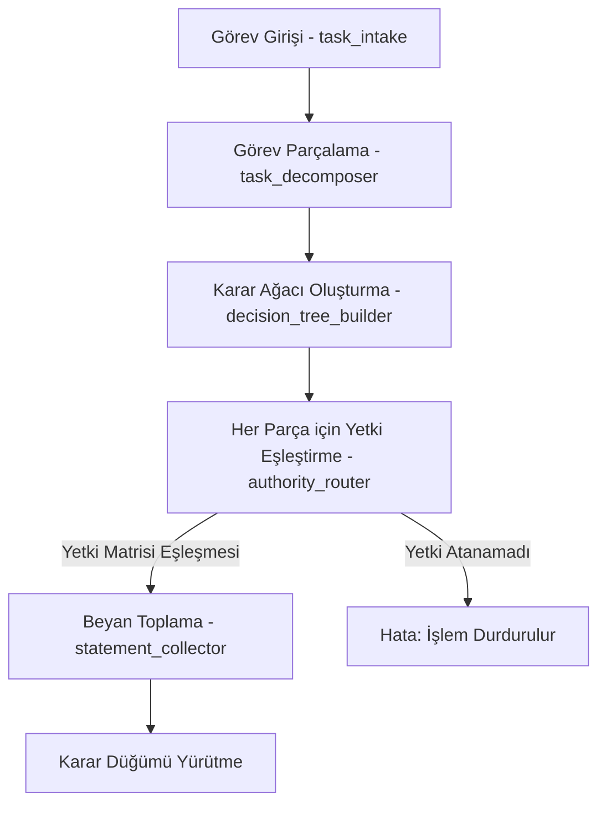

# Karar Akışı (Decision Flow)

Sistemdeki dağıtık yetki ve karar mekanizmasının işleyiş akışı:

## 🛡️ "Kendi Çıktısını Onaylayamama" Güvenlik Filtresi
1. Bir AI provider (`openai` veya `gemini`) kod veya karar beyanı üretir.
2. Bu beyan `statement_collector` tarafından kayıt altına alınır.
3. Ancak bu karar düğümü riskliyse (`high` veya `critical`), ilgili karar düğümü AI tarafından onaylanamaz; onay mekanizması (`approval_manager`) devreye girerek nihai kullanıcı ekranına düşürür.
